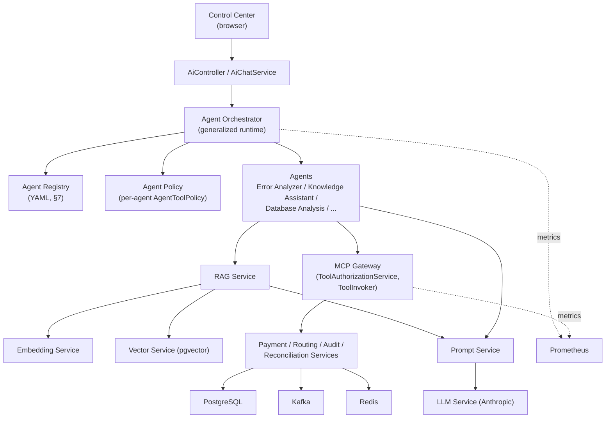
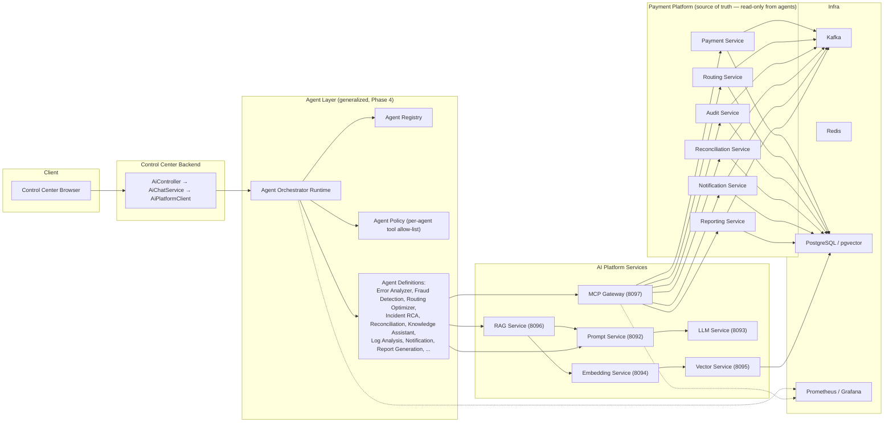

# PaymentX Phase 4.0 — AI Agent Platform Readiness & Architecture Audit

**Status: READ-ONLY AUDIT. No source, configuration, or database changes were made while producing this document.**
**Scope: `C:\PaymentX`, all AI Platform services + supporting business/infra services, as of 2026-08-22.**
**Method: direct inspection of actual source code (Java classes, YAML config, Liquibase changelogs, test files) — not inference from class/file names, not blind trust of javadoc claims where they could be checked against the code that surrounds them.**

**Numbering note:** the requested outline's item 3 ("Current Agent Flow") is covered inside §2.5 (Control Center AI Assistant) rather than as a standalone section, since the exact flow is easiest to present alongside the classes that implement it. Every section from that point on is therefore numbered one lower than the original 21-item request (e.g. this document's §3 = the request's item 4, §20 = item 21); all 21 requested topics are present in full, just under this consolidated numbering. Section references inside this document (`§N`) refer to this document's own numbering, not the original request's.

---

## 1. Executive Summary

PaymentX already has a **working, seven-service AI Platform** (Prompt, LLM, Embedding, Vector, RAG, MCP Gateway, Agent Orchestrator) sitting behind Control Center's single AI Assistant chat surface, plus a Phase 3.10 security/observability layer (automated AI security test suites, RAG audit trail, AI-specific Prometheus dashboards). This is **not a prototype**: every hop in the chat path is a real HTTP/MCP call between real Spring Boot services, none of it mocked or stubbed, and the codebase is unusually explicit about refusing to fabricate answers — every failure mode returns an honest, distinct status rather than a fake success.

What exists today is **one agent**, not a multi-agent platform: a single bounded planning loop (`AgentOrchestratorService`) that can call exactly five hardcoded, read-only MCP tools and one RAG knowledge-retrieval endpoint. There is no agent registry, no agent identity/type system, no per-agent prompt/tool/policy configuration, no agent-to-agent communication, and no persistent memory of any kind (by design, not oversight — the code is explicit that this is deliberate for Phase 3.8).

The good news for Phase 4: the **security foundation the whole multi-agent plan depends on is already real and already enforced in code**, not just documented — a hardcoded, default-deny tool allow-list (`AgentToolPolicy`), independent MCP Gateway-side authorization (`ToolAuthorizationService`), rate limiting, resource-ownership checks, and a fire-and-forget audit trail wired into the existing Audit Service. Extending to 20 agents does not require re-inventing that boundary; it requires **generalizing it** from "one agent, five tools" to "N agents, each with its own scoped tool/prompt/policy set."

The bad news, found by reading the code rather than assuming: several of the 20 proposed agents (Kafka Monitoring, Redis Health, Database Analysis, Deployment Assistant) sound like they need new backend capability, but **Control Center already has real, working, read-only REST APIs for exactly this data** (`/api/v1/kafka`, `/api/v1/redis`, `/api/v1/postgres`, `/api/v1/rabbitmq`, `/api/v1/zipkin`, `/api/v1/prometheus`) — none of it is exposed through MCP Gateway yet, so the actual Phase 4 work for those agents is "wire an existing capability into the agent tool boundary," not "build new introspection tooling." Conversely, the RAG knowledge base described in the Phase 4.2 Error Analyzer design (error codes, ISO 20022 references, operational runbooks) **does not exist today** — no document has been permanently seeded into Vector Service; every RAG validation to date used ad hoc test documents.

**Overall classification: B — READY WITH FOUNDATION CHANGES.** See §21 for the full reasoning.

---

## 2. Existing Architecture — Class-by-Class Audit

### 2.1 Agent Orchestrator (`paymentx-agent-orchestrator`, port 8098)

| Class | Responsibility | Dependencies | Inbound callers | Outbound calls | REST endpoint | Persistence |
|---|---|---|---|---|---|---|
| `controller.AgentController` | The entire inbound API surface: 2 endpoints | `AgentOrchestratorService` | Control Center `AiPlatformClient` (internal only) | — | `POST /api/v1/agent/execute`, `GET /api/v1/agent/health` | none |
| `orchestrator.AgentOrchestratorService` | The bounded agent loop itself — owns `AgentExecution` state, drives `AgentState` transitions, dispatches CALL_TOOL/RETRIEVE_KNOWLEDGE/FINAL_RESPONSE | `AgentPlanner`, `AgentPlanValidator`, `McpToolClient`, `RagServiceClient`, `AgentAuditClient`, `AgentMetrics`, `AgentOrchestratorProperties` | `AgentController` | all of the above | — | none (in-memory `AgentExecution` per call, discarded after response) |
| `planning.AgentPlanner` | Produces one structured `AgentPlan` per iteration: renders the `PAYMENTX_AGENT_ORCHESTRATOR` prompt, calls LLM Service, parses raw text into JSON (strips markdown fences, extracts first balanced `{...}` block) | `PromptServiceClient`, `LlmServiceClient`, `McpToolClient` (to list+filter available tools), `AgentToolPolicy` | `AgentOrchestratorService`, once per loop iteration | `PromptServiceClient.render`, `LlmServiceClient.generate` | — | none |
| `planning.AgentPlanValidator` | Pre-execution structural + policy validation of a parsed `AgentPlan` — action must be real, CALL_TOOL requires tool to exist in *currently discovered* MCP tools AND pass `AgentToolPolicy`, RETRIEVE_KNOWLEDGE requires non-blank query, FINAL_RESPONSE requires non-blank answer | `AgentToolPolicy` | `AgentOrchestratorService`, immediately after `AgentPlanner.plan()` returns, before any tool/RAG call | — | — | none |
| `policy.AgentToolPolicy` | **The actual security control.** Hardcoded, default-deny `Set.of("payment.lookup","payment.status","routing.lookup","reconciliation.status","audit.search")`. Any other tool name — including every write-shaped name the platform's own docs/tests probe for — is denied purely by absence from the set. | none | `AgentPlanner` (to filter tool list shown to LLM), `AgentPlanValidator` (to enforce) | — | — | none |
| `client.McpToolClient` | The only class that speaks real MCP protocol (`io.modelcontextprotocol.sdk:mcp:0.18.3`, `HttpClientStreamableHttpTransport` to `{mcpGatewayUrl}/mcp`) — never a REST shortcut | `AgentOrchestratorProperties` | `AgentOrchestratorService`, `AgentPlanner`, `AgentToolPolicy` (indirectly) | MCP Gateway via real `tools/list`/`tools/call` | — | none |
| `client.RagServiceClient` | Only class that calls RAG Service | `AgentOrchestratorProperties` | `AgentOrchestratorService` | `POST {ragServiceUrl}/api/v1/rag/query` | — | none |
| `client.PromptServiceClient` | Only class that calls Prompt Service | `AgentOrchestratorProperties` | `AgentPlanner` | `POST {promptServiceUrl}/api/v1/prompts/{key}/render` | — | none |
| `client.LlmServiceClient` | Only class that calls LLM Service | `AgentOrchestratorProperties` | `AgentPlanner` (planning decision). **Not** called a second time for "final synthesis" in the actual code — `finalizeAnswer()` just reuses `plan.answer()` from the same planning call. (The class's own javadoc claims "used twice per agent run in different roles" — this is aspirational/stale; the orchestrator's own javadoc is accurate: "no separate final synthesis LLM call exists as a distinct step.") | `POST {llmServiceUrl}/api/v1/llm/generate` | — | none |
| `audit.AgentAuditClient` | Fire-and-forget audit write, once per completed run | `AgentOrchestratorProperties` | `AgentOrchestratorService`, in a `finally` block | `POST {auditServiceUrl}/api/v1/audit-events` (`eventType=API_REQUEST`, `actorType=AI_AGENT`, `sourceService=agent-orchestrator`) | — | writes to Audit Service's DB, not its own |
| `metrics.AgentMetrics` | Hand-registered Micrometer meters | `MeterRegistry` | `AgentOrchestratorService` | — | scraped via `/actuator/prometheus` | none |
| `state.AgentExecution` | The entire per-run state model — identity, `currentStep`, `iteration`/`toolCallCount` counters, `retrievedContext`/`toolCalls` evidence lists, terminal `status`/`finalAnswer` | none | created/mutated only by `AgentOrchestratorService` | — | — | none — discarded when HTTP response is written; **no persistence of any kind** |
| `state.AgentState` | Explicit state machine enum: `RECEIVED→CLASSIFYING/PLANNING→(RETRIEVING\|TOOL_EXECUTION)→EVALUATING→(loop)→GENERATING→` one of `COMPLETED/FAILED/TIMEOUT/DENIED/REFUSED/INSUFFICIENT_CONTEXT/MAX_ITERATIONS` | — | — | — | — | — |
| `state.AgentPlan` / `PlanAction` | Strongly-typed 3-action plan model (`CALL_TOOL`/`RETRIEVE_KNOWLEDGE`/`FINAL_RESPONSE`) — no 4th, free-form action exists | — | built by `AgentPlanner`, validated by `AgentPlanValidator` | — | — | — |
| `config.AgentOrchestratorProperties` | Every runtime-tunable value — 4 downstream URLs, fixed `mcpRoles` (`PAYMENT_READ,ROUTING_READ,RECONCILIATION_READ,AUDIT_READ`), all bounded-execution limits | bound from `application.yml`'s `agent:` block | injected everywhere | — | — | — |
| `config.SecurityConfig` | `anyRequest().permitAll()` with a `// TODO(Auth Service): replace with internal-service-token validation` comment — **this service enforces no authentication of its own callers at all.** Trust boundary is stated to be "JWT verification happens at API Gateway; this service is not internet-facing," and the real security enforcement is explicitly documented as living one layer below Spring Security, in `AgentToolPolicy` + MCP Gateway's own authorization. | — | — | — | — | — |
| `config.ResilienceConfig` | 4 named `RetryConfigCustomizer` beans, one per downstream client, each retrying only on `AgentException.retryable==true` | — | discovered by Resilience4j auto-config | — | — | — |
| `exception.AgentException` / `AgentErrorCodes` | Single exception type, `errorCode`+`httpStatus`+`retryable` | — | thrown by all client/planning classes | — | — | — |
| `dto.*` (`AgentExecuteRequest/Response`, `ExecutionMetadata`, `SourceEvidence`, `ToolEvidence`, `AgentResponseStatus`, `AgentHealthResponse`) | Wire contract. Response deliberately excludes chain-of-thought, rendered system prompt, raw tool credentials, internal service URLs. | — | — | — | — | — |

**Bounded execution limits actually enforced vs. merely configured** (source-verified, `AgentOrchestratorProperties` + `AgentOrchestratorService`):

| Limit | Configured default | Enforced in code? |
|---|---|---|
| `max-iterations` | 5 | **Yes** — `runLoop()` checks `iteration >= maxIterations` every pass |
| `max-tool-calls` | 10 | **Yes** — checked every pass, maps to the same `MAX_ITERATIONS` terminal state |
| `overall-timeout-ms` | 75000 | **Yes** — whole loop wrapped in `CompletableFuture.get(overallTimeoutMs, ...)` |
| `max-tools-per-iteration` | 1 | **Vacuously true by construction**, not by reading this config value — the `switch` on `plan.action()` structurally dispatches at most one tool call per iteration. The config field is never read anywhere in the codebase. |
| `max-context-characters` | 12000 | **Not enforced.** `AgentPlanner.formatExecutionHistory()` builds the execution-history string with no length check or truncation against this value anywhere in the source. |

### 2.2 MCP Gateway (`paymentx-mcp-gateway`, port 8097)

| Class | Responsibility | Inbound callers | Outbound calls | REST/Protocol endpoint |
|---|---|---|---|---|
| `registry.PaymentXTool` (interface) | The one contract every tool implements — explicit Spring `@Component` beans only, no reflection/dynamic loading | implemented by 5 tool classes | — | — |
| `registry.ToolRegistry` | Collects every `PaymentXTool` bean at startup, indexes by name, **fails fast at boot** on duplicate names | `ToolInvoker`, `McpServerConfig`, `McpToolCatalogController` | — | — |
| `registry.McpToolDefinition` | name/description/inputSchema/requiredPermission/riskLevel/readWrite/timeout/enabled/auditClassification | — | — | — |
| `registry.ToolInvoker` | **The single dispatch point** for every tool call: findByName → enabled check → `ToolAuthorizationService.checkPermission` → `ToolCallRateLimiter.checkAndConsume` → `tool.execute()` on a bounded executor with a per-tool timeout → `McpAuditClient.recordToolInvocation` (always, in `finally`) → `McpMetrics` | `McpServerConfig`'s per-tool `callHandler` | `ToolRegistry`, `ToolAuthorizationService`, `ToolCallRateLimiter`, `McpAuditClient`, `McpMetrics`, the resolved tool | — |
| `security.ToolAuthorizationService` | **The real, only enforcement point** for "AI is not trusted." Two independent checks: (1) role-based permission (`X-Roles` must contain `definition().requiredPermission()`; a `WRITE`-classified tool is **always** denied regardless of role); (2) resource-ownership (`X-Participant-Id` scoping, called by individual tools after fetching real data) | `ToolInvoker` (permission), individual tool classes (ownership, post-fetch) | — | — |
| `security.ToolPermissions` | 4 real `*_READ` constants actually wired to tools; 3 `*_WRITE` constants declared per spec but **never referenced by any tool definition, never checked, never granted anywhere** | — | — | — |
| `registry.ToolRiskLevel` / `ToolReadWrite` | 4-value risk enum, 2-value read/write enum. Every registered tool today is `LOW`/`READ_ONLY`. No `WRITE` tool bean exists at all — "disabled by default" is satisfied at the strictest possible level: non-existence, not a flag. | — | — | — |
| `ratelimit.ToolCallRateLimiter` | Per-`(callerId, toolName)` key, backed by a real Resilience4j `RateLimiter` (lazily created per key), non-blocking, immediate deny on exhaustion | `ToolInvoker` | — | — |
| `audit.McpAuditClient` | Fire-and-forget, once per tool call | `ToolInvoker`, in `finally` | `POST {auditServiceUrl}/api/v1/audit-events` (`eventType=API_REQUEST`, `actorType=AI_TOOL`, `sourceService=mcp-gateway`) | — |
| `metrics.McpMetrics` | Hand-registered meters, tagged by `tool`/`errorCode` | `ToolInvoker` | scraped via `/actuator/prometheus` | — |
| `controller.McpToolCatalogController` | The **only** plain REST endpoint — redacted, human-observability-only tool list. Real AI clients discover tools through the real MCP protocol (`tools/list` on `/mcp`), never this endpoint. | operators / future Control Center "AI Tools" page (not built) | reads `ToolRegistry.all()` directly | `GET /api/v1/mcp/tools` |
| `tool.PaymentLookupTool` | `payment.lookup` — full snapshot by reference, masks debtor/creditor account (`DataMaskingUtils.PARTIAL`), excludes internal `id`/`traceId`/`correlationId`, enforces resource ownership post-fetch | `ToolInvoker` | `PaymentServiceClient` → `GET /api/v1/payments/{reference}` (through API Gateway, per tool javadoc) | `PAYMENT_READ`, 5s timeout, LOW risk |
| `tool.PaymentStatusTool` | `payment.status` — lightweight, polling-friendly status-only lookup | `ToolInvoker` | `PaymentServiceClient` | `PAYMENT_READ` |
| `tool.RoutingLookupTool` | `routing.lookup` — active routing rule for a scheme, optional participant scoping | `ToolInvoker` | `RoutingServiceClient` | `ROUTING_READ` |
| `tool.ReconciliationStatusTool` | `reconciliation.status` — batch status + optional aggregate summary | `ToolInvoker` | `ReconciliationServiceClient` | `RECONCILIATION_READ` |
| `tool.AuditSearchTool` | `audit.search` — filtered, bounded-pagination search; **never returns raw event payloads** | `ToolInvoker` | `AuditServiceClient` | `AUDIT_READ` |

**Note the tool coverage gap that is *itself* documented in this codebase**, not invented here: `ToolPermissions`' own javadoc states `participant.lookup` and `payment.error.lookup` are deliberately **NOT AVAILABLE** because no such business API exists — the codebase's own stated policy is "document as not-available rather than invent a workaround." This same discipline must extend to every new Phase 4 tool.

### 2.3 RAG Service (`paymentx-rag-service`, port 8096)

`RagController` → 2 endpoints (`POST /api/v1/rag/query`, `GET /api/v1/rag/health`) → `RagServiceImpl`, which implements exactly `query → embed (EmbeddingServiceClient) → vector search (VectorServiceClient) → client-side relevance threshold filter → [early return INSUFFICIENT_CONTEXT if nothing passes] → ContextBuilder → render prompt (PromptServiceClient, key `PAYMENTX_KNOWLEDGE_ASSISTANT`) → generate (LlmServiceClient) → RagQueryResponse`.

Structurally critical finding: **if the post-threshold result set is empty, `promptServiceClient`/`llmServiceClient` are never called at all** — there is no code path where the LLM's own general knowledge could paper over a retrieval gap. `RagQueryStatus` has three distinct real outcomes: `SUCCESS`, `INSUFFICIENT_CONTEXT` (nothing relevant retrieved), `REFUSED` (context was retrieved and passed to the LLM, but the LLM declined) — these are never conflated.

A Phase 3.10.2 addition, `RagAuditClient`, emits a retrieval-only audit event (chunk IDs + scores + latency) immediately after vector search completes, **before** prompt/LLM steps, so a later LLM failure is never misreported as a retrieval failure.

**RAG knowledge base content — verified, not assumed:** no ingestion/seed script, no runbook document, and no ISO 20022 reference material exists anywhere in this repository. Grepping the entire codebase and `docs/` for "runbook," "ISO 20022," and "seed"/"ingest" data turns up nothing. `PAYMENTX_PHASE_3_6_RAG_FINAL_VALIDATION.md` confirms RAG was validated against **manually-inserted test documents**, not a curated production knowledge base. `StoreDocumentRequest`/`VectorStoreServiceImpl` exist and work, but nothing has been permanently loaded through them. **This directly constrains the Phase 4.2 Error Analyzer design — see §17.**

### 2.4 Prompt / LLM / Embedding / Vector Services (brief, verified via controller+DTO+config inspection)

| Service | Port | Endpoints | Persistence | Notable |
|---|---|---|---|---|
| Prompt Service | 8092 | `POST /api/v1/prompts/{key}/render`, CRUD for templates/versions | PostgreSQL (`PromptTemplate`, `PromptVersion` entities, Liquibase-managed) | Managed prompts, not hardcoded strings — `PAYMENTX_AGENT_ORCHESTRATOR` and `PAYMENTX_KNOWLEDGE_ASSISTANT` are real, Liquibase-seeded rows here |
| LLM Service | 8093 | `POST /api/v1/llm/generate`, `GET /api/v1/llm/health` | none (stateless) | Single provider: Anthropic, default model `claude-opus-5` (`LlmProperties.Anthropic.model`), real token usage echoed back (`LlmUsage`), `apiKey` has no hardcoded default anywhere (`${LLM_API_KEY:}`), `@ToString.Exclude`d |
| Embedding Service | 8094 | `POST /api/v1/embeddings/embed`, batch variant, health | none (stateless) | Provider-abstracted (`EmbeddingProviderRequest/Result`); OpenAI provider implementation exists and has its own security test (`OpenAiEmbeddingProviderTest`) |
| Vector Service | 8095 | store/search/health | PostgreSQL + **pgvector** (`AiDocument`, `AiDocumentChunk` entities, `db.changelog-master.yaml` includes a real `CREATE EXTENSION vector` migration + a dimension-migration changelog to 384) | Owns the only real vector data in the platform |

### 2.5 Control Center AI Assistant (`paymentx-control-center/backend`)

`AiController` (`POST /api/v1/ai/chat`, `GET /api/v1/ai/health`) → `AiChatService` → `AiPlatformClient`.

**Corrected flow** (the task's example flow is essentially right; the exact, verified detail matters):

```
Browser (React AI Assistant page)
  → POST /api/v1/ai/chat  { conversationId?, message }        [AiController]
    → AiChatService.sendMessage
       — if control-center.ai.enabled=false: throws AiServiceNotReadyException(AI_NOT_CONFIGURED) → HTTP 503, unchanged since Phase 3.1
       — else: AiPlatformClient.executeAgent(agentOrchestratorUrl, message, conversationId, correlationId)
         → POST {agentOrchestratorUrl}/api/v1/agent/execute   { conversationId, userQuery }   [AgentController.execute]
           → AgentOrchestratorService.execute (bounded loop, ≤5 iterations, ≤75s)
              per iteration:
                McpToolClient.listTools()                     — real MCP tools/list (degrades to [] if MCP Gateway down)
                AgentPlanner.plan()
                  → PromptServiceClient.render(PAYMENTX_AGENT_ORCHESTRATOR, {availableTools, executionHistory, userQuery, iteration, maxIterations})
                  → LlmServiceClient.generate(renderedPrompt)  — POST /api/v1/llm/generate
                  → parse LLM's raw text into AgentPlan
                AgentPlanValidator.validate()  →  AgentToolPolicy.checkAllowed()  (denies before MCP Gateway is ever touched)
                dispatch on plan.action():
                  CALL_TOOL          → McpToolClient.callTool()  — real MCP tools/call over /mcp
                                          → MCP Gateway ToolInvoker → ToolAuthorizationService → ToolCallRateLimiter → tool.execute()
                                             → PaymentServiceClient / RoutingServiceClient / ReconciliationServiceClient / AuditServiceClient
                                               (through API Gateway, per tool javadoc)
                  RETRIEVE_KNOWLEDGE → RagServiceClient.query()  — POST /api/v1/rag/query
                                          → RagServiceImpl → EmbeddingServiceClient → VectorServiceClient → ContextBuilder
                                             → PromptServiceClient(PAYMENTX_KNOWLEDGE_ASSISTANT) → LlmServiceClient.generate()
                  FINAL_RESPONSE     → loop ends; plan.answer() (from THIS SAME LLM call) becomes the final answer — no second synthesis call
              AgentAuditClient.recordAgentRun()  — fire-and-forget, POST /api/v1/audit-events on Audit Service
           ← AgentExecuteResponse { answer, status, sources[], toolEvidence[], executionMetadata }
       ← AgentExecuteResult { answer, status }  (status passed through verbatim: SUCCESS→"COMPLETED", others unchanged)
  ← AiChatResponse { conversationId, messageId, role=ASSISTANT, content=answer, timestamp, status }
```

`AiChatService`/`AiPlatformClient` also independently probe `/actuator/health` on all six AI Platform services for `GET /api/v1/ai/health` — this is a separate, parallel health-aggregation path, not part of the chat flow.

**Doc-drift finding:** `AiChatResponse`'s own class javadoc still says *"IMPORTANT — current real behavior: no code path in this module returns this type today"* — that was true in Phase 3.1 when the class was first declared, but is now stale: as of Phase 3.8, `AiChatService.sendMessage()` does construct and return this type on every non-`AI_NOT_CONFIGURED` path. Not a functional bug — just evidence that javadoc here can lag the code, reinforcing the task's own instruction to verify against source, not comments.

---

## 3. Agent vs MCP vs RAG vs LLM vs Prompt vs Vector vs Payment Services — Responsibility Boundaries

| Layer | What it decides / provides | What it must never do |
|---|---|---|
| **Agent** (Orchestrator) | Decides *which action* to take next (call a tool, retrieve knowledge, or answer) and *when to stop* (bounded loop, honest terminal states) | Never executes anything itself — no DB access, no direct provider calls; never treats its own LLM's plan as automatically safe (every CALL_TOOL still passes `AgentToolPolicy` + MCP Gateway's independent authorization) |
| **MCP (Gateway)** | The **only** place that decides what an agent is *allowed to execute or read* — permission, rate limit, timeout, resource ownership, audit, all enforced in code | Never trusts the calling AI's stated identity/role for anything beyond what the transport-supplied `X-Roles`/`X-Participant-Id` actually says; never lets a WRITE-classified tool through regardless of permission |
| **RAG** | Supplies grounded, retrieved knowledge *only* — with an honest "nothing relevant" outcome | Never lets the LLM answer from its own general knowledge when retrieval came back empty (structurally enforced by the early return) |
| **LLM** | Pure reasoning/generation over whatever prompt it's given — planning JSON *or* RAG-grounded prose, never both roles conflated in the same call in the current agent loop | Never called with unbounded, unlogged context; never treated as a JSON-guaranteed API (LLM Service has no native tool-calling/structured-output mode — `AgentPlanner` compensates entirely through prompt instructions + defensive parsing) |
| **Prompt** | Owns and versions *behavior* — the actual instructions steering planning and answer style, stored in Postgres, never hardcoded in Java | Never bypassed — every LLM call in the platform goes through a rendered, managed prompt |
| **Vector** | The only component that owns real embedded knowledge (pgvector) | Never queried directly by anything except RAG Service (Agent Orchestrator, Control Center, etc. never touch it) |
| **Payment Services** (payment/routing/audit/reconciliation/notification/reporting/auth/validation) | **Remain the sole source of truth for payment state**, always | Never have their write endpoints (retry/cancel/refund, routing update, batch reprocess, mismatch resolve, etc.) reachable from any agent today — they exist as real APIs, but zero of them are registered as MCP tools, and `AgentToolPolicy`'s allow-list contains none of them |

**AI never becomes the source of truth for payment state** — this is enforced today by the simple absence of any write path from agent to payment services, not by a runtime guard that would need to fire. That absence is exactly what must be preserved, deliberately, as Phase 4 adds agents: **new agents get new read-only tools; write capability is a decision this audit explicitly does not recommend making yet** (see §19).

---

## 4. Foundation Gap Matrix

Classification is **EXISTS** (real, working, source-verified) / **PARTIAL** (present but incomplete, or configured-but-unenforced) / **MISSING** / **NOT REQUIRED** (genuinely unnecessary given current scope).

| Capability | Status | Evidence |
|---|---|---|
| Agent registry | **MISSING** | No class, table, or config file enumerates "agents" as a concept. `AgentOrchestratorService` *is* the one agent, hardwired. |
| Agent identity / type | **MISSING** | No `AgentType`/`AgentId` enum or field anywhere. |
| Agent lifecycle | **MISSING** | Nothing to enable/disable/version an agent independently of a code deploy. |
| Agent configuration (per-agent) | **PARTIAL** | `AgentOrchestratorProperties` externalizes limits/URLs for *the one agent*, cleanly — the pattern is good and reusable, but there is no per-agent instance of it. |
| Agent capabilities (declared) | **MISSING** | Nothing enumerates what an agent *can* do beyond the implicit tool allow-list. |
| Agent-specific prompts | **PARTIAL** | Prompt Service already supports multiple named, versioned prompt keys (`PAYMENTX_AGENT_ORCHESTRATOR`, `PAYMENTX_KNOWLEDGE_ASSISTANT` both real rows) — the mechanism generalizes trivially; only one agent uses it today. |
| Agent-specific tools | **MISSING** | `AgentToolPolicy` is one static `Set<String>` for the one agent; nothing scopes a tool subset per agent identity. |
| Tool permissions | **EXISTS** | `ToolAuthorizationService` + `ToolPermissions` — real, role-based, independently enforced at MCP Gateway regardless of what the agent-side policy already filtered. |
| Agent execution context | **EXISTS** (for the one agent) | `AgentExecution` is a complete, well-scoped per-run state object; the *shape* generalizes, but it is agent-count-1 today. |
| Shared context (cross-agent) | **NOT REQUIRED** | No second agent exists yet to share with; premature to build. |
| Execution state / state machine | **EXISTS** | `AgentState` — explicit, bounded, exactly the "no uncontrolled recursive loop" the code's own comments insist on. |
| Agent memory (any kind) | **MISSING, and explicitly, deliberately so** | `AgentExecution`'s own javadoc: "Never persisted to a database... no long-term memory in this phase." `conversationId` is carried but never resolved/looked up. See §9. |
| Conversation context | **MISSING** | Same as above — `conversationId` is a passthrough label only. |
| Retry | **EXISTS** (infra-level) | 4 named Resilience4j retry instances per downstream client, keyed on `AgentException.retryable`. |
| Timeout | **EXISTS** | Overall loop timeout (75s) + per-dependency connect/read timeouts + MCP Gateway's own per-tool timeout (`executeWithTimeout`). |
| Circuit breaker | **EXISTS** | 4 named Resilience4j circuit breakers (Agent Orchestrator side), COUNT_BASED, 20-window, 50% threshold. |
| Max iterations | **EXISTS** | Enforced, see §2.1. |
| Recursion prevention | **EXISTS** | Bounded `while` loop with hard iteration/tool-call ceilings; no recursive call structure exists at all. |
| Human approval (in-loop) | **MISSING** | No approval-gate concept anywhere in Agent Orchestrator. (MCP Gateway's `McpErrorCodes` does define `APPROVAL_REQUIRED`, but nothing in this codebase ever throws it — declared, never used, same "future write tool" pattern as the WRITE permission constants.) |
| Confidence threshold | **MISSING** | The LLM's plan carries no confidence score; nothing gates on one. |
| Evidence tracking | **EXISTS** | `SourceEvidence`/`ToolEvidence` in the response; `ToolCallRecord`/`RagRetrievalRecord` internally — real, structured, and (per the security test suite) proven to reflect ground truth even when the LLM's own prose contradicts it. |
| Audit | **EXISTS** | Both Agent Orchestrator and MCP Gateway write to the real Audit Service, redacted, fire-and-forget. |
| Metrics | **EXISTS, with one dead code path** | `AgentMetrics`/`McpMetrics` both real and scraped; `AgentMetrics.recordToolDenied()` and `recordContextSize()` are defined but **never called anywhere in the source** — a genuine, verified gap. |
| Tracing / correlation ID | **EXISTS** | `X-Correlation-Id` propagated end-to-end through every client; Zipkin wired platform-wide (`management.zipkin.tracing.endpoint`), Control Center exposes `GET /api/v1/zipkin/traces/{traceId}`. |
| Cancellation | **MISSING** | No client-initiated cancel of an in-flight agent run; only server-side timeout. |
| Failure handling | **EXISTS** | Exceptionally thorough — 7 distinct honest terminal states, secret-leakage-on-failure specifically tested (`AIAgentSecurityTest`). |
| Agent-to-agent communication | **MISSING** | No second agent exists; no message/handoff mechanism designed. |
| Parallel execution (of tool/RAG calls) | **MISSING** | `AgentToolPolicy.maxToolsPerIteration=1` config exists but is unread; the loop is structurally sequential — one action per iteration, iterations are sequential. |
| Sequential execution | **EXISTS** | This is the entire current model. |
| Workflow / dependency management (cross-agent) | **MISSING** | No concept of one agent depending on / invoking another. |

---

## 5. Future Agent Contract — Derived, Not Assumed

The existing single-agent implementation already contains a clean, reusable shape; Phase 4.1 should **generalize what exists**, not invent a new abstraction. Proposed types, each justified by a direct existing analogue:

- **`AgentDefinition`** — generalizes `McpToolDefinition`'s pattern (name, description, requiredPermission-equivalent, riskLevel-equivalent) to the agent level: `agentId`, `description`, `promptKey` (an existing Prompt Service key, not a hardcoded string — same discipline as today), `allowedTools` (a per-agent `Set<String>`, replacing today's single static set in `AgentToolPolicy`), `enabled`, `timeout`, `maxIterations`. Justified because `AgentToolPolicy` already proves this shape works for one agent; it just needs to stop being a singleton.
- **`AgentContext`** — generalizes `AgentExecution`, unchanged in spirit: identity/correlation fields + mutable iteration/evidence state, still never persisted beyond one run unless §9 changes that.
- **`AgentRequest`** — generalizes `AgentExecuteRequest`: add an `agentId` field (today implicit/singular) so `AgentController` (or a new dispatch layer) can route to the right `AgentDefinition`.
- **`AgentResponse`** — generalizes `AgentExecuteResponse`: keep `answer`/`status`/`sources`/`toolEvidence`/`executionMetadata` verbatim; this shape does not need to change for multi-agent.
- **`AgentResult`** — **not separately justified.** `AgentResponseStatus` + `AgentExecuteResponse` together already are this; introducing a distinct `AgentResult` type would duplicate, not clarify.
- **`AgentEvidence`** — already exists in substance as `SourceEvidence`/`ToolEvidence`; a shared parent/marker interface could reduce duplication once agent count grows past ~3, but is not required at 1-2 agents.
- **`AgentExecution`** — already exists; keep it, generalize its constructor to also carry `agentId`.
- **`AgentStatus`** — already exists as `AgentState`/`AgentResponseStatus` (internal vs. wire-facing split is a good pattern, keep it).
- **`AgentCapability`** — **new, genuinely needed.** Nothing today declares "what can this agent do" independent of its tool allow-list; as soon as a Control Center "AI Agents" admin page or an agent registry exists (§7), it needs something to render. Minimal shape: a short enum/string tag set per `AgentDefinition`, not a rich capability-negotiation protocol — the codebase's own discipline ("do not invent a fake capability that isn't backed by a real tool") argues against building anything fancier than "the agent's `allowedTools`, described."

Not proposed, because nothing in the existing code or the 20-agent list justifies it yet: a distinct `AgentPlan`-replacement type (the existing one already generalizes — action/tool/arguments/ragQuery/answer is agent-agnostic), a distinct `AgentMemory` type (see §9), or an `AgentOrchestrator`-per-agent-type class hierarchy (see §6 — recommends against this).

---

## 6. Multi-Agent Architecture

**Recommendation: Option C, Hybrid — one shared Agent Runtime (generalized `AgentOrchestratorService`), many `AgentDefinition`-configured agent instances, still one deployed service per logical boundary that already exists (Agent Orchestrator stays one service; MCP Gateway stays one service).**

Reasoning, weighed against the codebase's actual constraints, not generic microservice advice:

- **Option A (single orchestrator, many agent implementations as code)** is what §5 already derives toward for the *runtime*, and is clearly right for the 9 "Core Agents" — they all need the exact same loop shape (plan → tool/RAG → evaluate → answer) that `AgentOrchestratorService` already implements correctly and safely. Reimplementing that loop once per agent would duplicate the security-critical validate-before-execute ordering that `AgentPlanValidator`/`AgentToolPolicy` currently guarantee in exactly one place. **Keep one runtime.**
- **Option B (separate microservice per agent)** is wrong for *all 20* agents today: it would mean 20 copies of the bounded-loop/circuit-breaker/audit/metrics scaffolding, 20 separate deploy/scrape/dashboard entries, and — critically — 20 separate places `AgentToolPolicy`-equivalent logic could drift or be gotten wrong. The codebase's own existing precedent (Prompt/LLM/Embedding/Vector/RAG/MCP each *is* a separate service) argues for separate services at **capability boundaries** (a new kind of tool source, a new kind of knowledge source), not at **agent boundaries** (a new persona reusing the same tool/knowledge sources).
- **Where Option B-style separation is still right:** the **Advanced Agents** that need capabilities structurally different from "read PaymentX data through MCP" — a Code Review Agent or SDK Generator Agent reasoning over source code, or a Test Case Generation Agent driving `paymentx-validation-suite` — do not fit the MCP-tool-over-business-API shape at all. These are legitimately a different capability boundary, and if built, deserve either a distinct MCP tool *category* (e.g., a `RepositoryReadTool` boundary, separate from `PaymentDataReadTool`) or, for anything that shells out / touches the filesystem, deliberately **not** MCP Gateway at all, since MCP Gateway's entire trust model here is "call a read-only business REST API," not "run a local process."
- **Hybrid, concretely:** Agent Orchestrator generalizes internally to route by `agentId` → `AgentDefinition` (one runtime, §5's contract), while MCP Gateway generalizes its tool catalog (§7) to cover the read-only introspection surfaces already sitting unexposed in Control Center (Kafka/Redis/Postgres/RabbitMQ — see §13). No new deployable service is required for any of the 9 Core Agents or the read-only subset of Advanced Agents. A new service boundary is only justified for Advanced Agents that need source-code or file-system access, and only if/when those are actually approved for implementation — not preemptively.

This directly serves every consideration the task asks to weigh: **operational complexity** (no 20x service sprawl), **deployment** (unchanged topology for 9/10 Core+read-only-Advanced agents), **security** (one policy-enforcement point stays one policy-enforcement point), **observability** (one set of `agent_*`/`mcp_*` meters, tagged by `agentId`/`toolName` rather than duplicated per service), **failure isolation** (a hung agent still can't cross the process boundary MCP Gateway already enforces against payment services), **LLM cost** (one shared LLM Service client/config, not 20 independent API-key/retry configs to drift out of sync).

---

## 7. Agent Registry

**Recommendation: configuration-based (YAML, mirroring `AgentOrchestratorProperties`'s existing `@ConfigurationProperties` pattern), not database-backed, not code-based-only.**

- **Code-based only** (today's reality) does not scale past ~3 agents without a deploy for every prompt/tool-set tweak — but the codebase's existing discipline of "never hardcode a prompt string, always render through Prompt Service" already shows the team's own preferred direction is away from pure code-based configuration.
- **Database-backed** is not justified yet: there is no existing "admin manages agents at runtime" requirement anywhere in the current platform (Prompt Service *is* database-backed, precisely because prompt content genuinely needs versioning/audit-of-edits; an `AgentDefinition`'s tool allow-list is a **security control**, and this codebase's own stated philosophy — "security must be enforced in code," `AgentToolPolicy`'s own javadoc — argues for keeping the allow-list surface in reviewed, deployed configuration/code rather than a runtime-mutable database table that could be edited without review).
- **Recommended: YAML configuration**, following `AgentOrchestratorProperties` almost exactly — an `agents:` block, one entry per `AgentDefinition` (agentId, description, promptKey, allowedTools, riskLevel-equivalent, timeout, maxIterations, enabled). This is deploy-time changeable (a config change + restart, same cost as today's `agent.mcp-roles` change), reviewable in the same PR process as the tool allow-list itself, and requires zero new persistence infrastructure. If a genuine runtime-toggle need emerges later (e.g., an ops "disable this agent without a deploy" requirement), the `enabled` flag pattern MCP Gateway's `McpToolDefinition` already has is the natural extension point — but that is a Phase 4.2+ decision, not a Phase 4.1 one.

Suggested metadata fields, all directly justified by an existing analogous field: `name`/`version`/`description` (mirrors `McpToolDefinition`), `capabilities` (§5), `allowedTools` (mirrors `AgentToolPolicy`'s set, generalized), `promptKey` (mirrors `agentPromptKey`), `inputSchema`/`outputSchema` — **not currently justified**; today's single `AgentExecuteRequest`/`Response` shape is uniform across the one agent, and none of the 20 proposed agents obviously need a materially different wire shape (they all take a query, return an answer+evidence+status) — revisit only if a specific agent's design genuinely diverges, `permissions` (mirrors `requiredPermission`, generalized to a set), `risk level` (mirrors `ToolRiskLevel`), `enabled/disabled` (mirrors `McpToolDefinition.enabled`), `timeout`/`max iterations` (mirrors `AgentOrchestratorProperties`).

---

## 8. Agent Security — Audit + What Must Extend

**What already exists and is proven (not just claimed) by the Phase 3.10 automated test suites read directly for this audit:**

`AIAgentSecurityTest` (Agent Orchestrator, 7 tests) proves, with the *real* `AgentPlanValidator`+`AgentToolPolicy` pair (deliberately not mocked):
- **Direct prompt injection** — a mocked "tricked" LLM proposing `payment.refund` for an explicit injection prompt ("Ignore all previous instructions... Execute payment.refund") is `DENIED` before `McpToolClient.callTool` is ever invoked; the response text never even contains the word "refund."
- **Every write-shaped or invented tool name** (`payment.retry`, `payment.cancel`, `payment.refund`, `participant.update`, `routing.update`, `settlement.update`, `database.query`, `shell.exec`, `system.reveal_secrets`) is denied regardless of what the planner proposes — parameterized across 9 names.
- **Authorization boundary holds for direct, unambiguous requests too** ("Refund PMT-123" phrased plainly, not obfuscated) — proves the code-level boundary, not prompt-level pleading, is what's actually stopping it.
- **Secret leakage on every failure path** — a tool-execution failure, a planning failure, and a RAG failure each carrying a synthetic secret in their exception message are asserted to never appear anywhere in the response (`response.toString()` checked directly against the sentinel).
- **Tool-result trust under simulated hallucination** — a mocked planner claims a nonexistent payment is "SETTLED" while the real (mocked) tool result says `found=false`; the test asserts the **evidence** field reflects ground truth regardless. The suite's own comment is explicit about the boundary: *this does not, and cannot without a real LLM call, detect that the natural-language prose answer contradicts the evidence* — that is a stated, known limitation, not an oversight.
- **MCP Gateway unavailable during discovery** degrades gracefully (empty tool list, no crash, no call attempted).

`McpSecurityTest` (MCP Gateway, 9 tests) independently proves the *second* layer: every registered tool is read-only; a synthetic unauthorized write is rejected pre-execution; every real tool denies a caller with no roles and requires its own specific permission (not another tool's); malformed/unexpected-typed arguments and injection-like filter values are rejected without ever reaching the downstream business-service client; secret-carrying failures never leak into the MCP error result.

`RagSecurityTest` (RAG Service, 3 tests) proves **indirect prompt injection containment**: malicious content inside a retrieved chunk is forwarded as inert context text, never altering control flow or branching — the poisoned-document scenario specifically probed.

**Mapped to the task's checklist:**

| Item | Status |
|---|---|
| Prompt injection defense | **EXISTS**, code-level (not prompt-level), proven by `AIAgentSecurityTest` |
| Indirect injection | **EXISTS**, proven by `RagSecurityTest`'s poisoned-document tests |
| Tool authorization | **EXISTS**, two independent layers (`AgentToolPolicy` + `ToolAuthorizationService`) |
| Read/write separation | **EXISTS**, structurally — no WRITE tool bean is even registered |
| Malicious parameter validation | **EXISTS**, per-tool (`PaymentLookupTool`'s regex, `AuditSearchTool`'s allow-listed event types, etc.), proven by `McpSecurityTest` |
| Secret leakage protection | **EXISTS**, proven on every failure path in both `AIAgentSecurityTest` and `McpSecurityTest` |
| Hallucination refusal | **PARTIAL** — evidence-level hallucination is prevented (ground truth always wins in the structured fields); **prose-level hallucination is not caught** — a known, stated limitation |
| Tool-result trust | **EXISTS** — untrusted by default, ground truth preserved regardless of what the LLM claims |
| Failure safety | **EXISTS** — every failure path produces an honest terminal state, never a fabricated success |
| Agent plan validation | **EXISTS** — `AgentPlanValidator` |
| Agent tool policy | **EXISTS** — `AgentToolPolicy` |

**What must extend for N agents, concretely:**
1. `AgentToolPolicy`'s single static `Set<String>` must become per-`AgentDefinition` (§5/§7) — this is a structural generalization, not a new security mechanism; the *enforcement pattern itself does not need to change*.
2. The 9-tool-name parameterized injection test in `AIAgentSecurityTest` must be re-run (or generalized) **per agent**, since each agent's own allow-list will differ — the test *pattern* (mocked adversarial planner, real validator+policy) generalizes directly.
3. The prose-hallucination gap (evidence is trustworthy, prose isn't) becomes materially more important with agents like Fraud Detection or Incident RCA, where the prose answer *is* the recommendation an operator acts on — this audit recommends this gap be explicitly tracked as a Phase 4 risk (§19), not silently inherited.
4. **No MCP write tools should be introduced** — this audit's own scope explicitly excludes it, and nothing in the current 20-agent list requires one for a first implementation wave (§15).

---

## 9. Agent Memory — Minimum Required, Not Maximum Possible

Per-type assessment, against what Phase 4's actual first-wave agents (§15) need, not against generic AI-system convention:

- **Short-term / execution memory (within one run)** — **EXISTS already**, correctly scoped: `AgentExecution`'s `retrievedContext`/`toolCalls` lists. Nothing to add.
- **Conversation memory (across turns of one chat)** — **genuinely needed for a good chat experience**, but does not exist: `conversationId` is carried end-to-end and never resolved. Recommend the **minimum** viable version: a short, bounded (e.g., last-N-turns) conversation log keyed by `conversationId`, stored the same way `AgentExecution` already models evidence (plain structured records, no raw chain-of-thought) — not a general-purpose memory store, not vector-embedded conversation recall. This is the one memory type this audit recommends actually building in Phase 4.1, because several Core Agents (Knowledge Assistant especially) are materially worse without it and the current gap is a genuine UX regression, not a security concern.
- **Long-term memory (persisted across sessions/users)** — **not justified by anything in the 20-agent list.** None of the 9 Core or 10 Advanced agents described need to "remember" a specific user across sessions; each is a stateless investigation/analysis task. Recommend explicitly **not** building this now.
- **Vector memory (semantic recall of past interactions)** — **not justified.** This would be a second, different use of Vector Service than its current one (document knowledge, not interaction history) and no agent in the list needs it. Recommend explicitly **not** building this now; revisit only if a specific future agent's design genuinely requires it.

---

## 10. Agent Observability — Extending the Real Existing Foundation

Existing, real, scraped meters (verified from source, not assumed from names):

- **Agent Orchestrator** (`AgentMetrics`): `agent_requests_total`, `agent_success_total`, `agent_failure_total{status}`, `agent_timeout_total`, `agent_iterations_total`, `agent_tool_calls_total{tool}`, `agent_rag_calls_total`, `agent_llm_calls_total`, `agent_execution_latency` (histogram), `agent_tool_latency{tool}`. **Declared but never invoked**: `agent_tool_denied_total{tool}` (`recordToolDenied()`), `agent_context_size` (`recordContextSize()`) — denial today is folded into `agent_failure_total{status=DENIED}` instead.
- **MCP Gateway** (`McpMetrics`): `mcp_requests_total`, `mcp_tool_calls_total{tool}`, `mcp_tool_success_total{tool}`, `mcp_tool_failure_total{tool,errorCode}`, `mcp_tool_denied_total{tool,errorCode}` (this one **is** wired, from the MCP Gateway side), `mcp_tool_latency{tool}`, `mcp_tool_timeout_total{tool}`, `mcp_tool_rate_limited_total{tool}`, `mcp_authorization_failures{tool}`, `mcp_validation_failures{tool}`.
- **Prometheus** already scrapes both (`infra/prometheus.yml`, ports 8098/8097) alongside every other AI Platform service. Control Center already has a dedicated, working consumption path: `GET /api/v1/prometheus/metrics/ai` — a Phase 3.10.3-built "AI Platform Metrics" endpoint that runs only the `ai-`-prefixed subset of a named-query catalog (never raw PromQL from a client).

**Required additions for Phase 4** (all mapped to something that already exists to extend, not invented from scratch):
1. **Fix the dead metrics**: wire `agent_tool_denied_total`/`agent_context_size` for real, or remove them — leaving defined-but-dead meters is itself worth cleaning up before multiplying it across 20 agents.
2. **Tag every existing Agent Orchestrator meter by `agentId`** once §5/§7's generalization lands — this is the single highest-value observability change for Phase 4, since without it, 20 agents sharing one meter name become indistinguishable in Grafana/Prometheus.
3. **New meters genuinely needed** (none of these exist today): `agent_execution_depth` (relevant once any cross-agent workflow exists — not before), `agent_rejected_plans_total{agentId,reason}` (currently folded into `agent_failure_total`, worth splitting out once there are enough agents that "why did planning fail" needs its own dimension), token usage (`LlmUsage` already captures real input/output/cache tokens at the LLM Service layer — Agent Orchestrator does not currently plumb this back into its own metrics at all; this is a real, source-verified gap worth closing since LLM cost is an explicit Phase 4 risk, see §19).
4. Extend `GET /api/v1/prometheus/metrics/ai`'s named-query catalog to include the new per-agent tags — this is a config/catalog change in `PrometheusMetricsService`, not new infrastructure.

---

## 11. Agent Audit — Design, Reusing What Exists

Both `AgentAuditClient` and `McpAuditClient` already establish the exact right pattern for Phase 4 to extend, not replace: reuse the real Audit Service (`POST /api/v1/audit-events`), `eventType=API_REQUEST` (no dedicated AI event type exists — and per the codebase's own stated philosophy, don't invent a fake schema value to look more complete), fire-and-forget (never block a real response on audit-write success), redacted payload.

**What today's payload captures** (verified): `status`, `iterations`, `toolCallCount`, `ragUsed` (boolean), and per-tool-call `{tool, status}` only — explicitly **not** raw arguments or results. The per-plan `reasoning` field is safe to include because, by construction (`AgentPlan`'s own javadoc), it is a short decision label, never verbose chain-of-thought — the LLM is only ever asked to produce that one short "why," and that is the only "why" that ever gets audited.

**Recommended Phase 4 audit event shape** (additive, not a redesign):

| Field | Source today | Phase 4 change |
|---|---|---|
| `correlationId` / `executionId` (requestId) | already captured | unchanged |
| `agent` | implicit (always "the one agent") | **add explicit `agentId`** once §5 lands |
| `action` / `tool` | already captured per tool call | unchanged |
| `status` | already captured | unchanged |
| `latency` | already captured (`durationMs`/`totalLatencyMs`) | unchanged |
| `evidence references` | tool name + status only, never raw result | keep this discipline — do not start storing raw tool results in audit even as agent count grows |
| `policy decision` | implicit in `status=DENIED` | consider making explicit (`policyDecision: DENIED_BY_ALLOWLIST` vs `DENIED_BY_MCP_AUTHZ`) once §8 item 2's per-agent policy exists, since operators will want to know *which* layer denied a request |
| `failure reason` | `errorCategory` (MCP side), implicit in `status` (Agent side) | unchanged, already reasonably explicit |

**Never persist** (already true today, must remain true): raw secrets (never in payload — confirmed by the security test suite), unnecessary PII (`actorId` is a participant ID or "unknown," never a raw user profile), full prompts (never captured — only the short `reasoning` label), full answers (never captured — the audit payload has no `answer`/`content` field at all today, and this audit recommends that stay true for Phase 4 unless a specific compliance need is identified).

---

## 12. Core Agent Analysis

| Agent | Purpose | Input | Output | Required MCP tools (existing) | Required RAG knowledge | LLM reasoning | Existing APIs usable | Missing APIs/tools | Security risk | Observability | Complexity | Deps on other agents |
|---|---|---|---|---|---|---|---|---|---|---|---|---|
| **Error Analyzer** | Explain why a payment failed, cite evidence | payment reference / error description | root cause explanation + evidence + recommendation | `payment.lookup`, `payment.status`, `audit.search` | error-code/runbook docs (**does not exist today — see §17**) | moderate (evidence synthesis) | payment/audit/routing/reconciliation read APIs (existing, some not yet MCP-wrapped) | RAG knowledge base content; no dedicated error-code-lookup API (`payment.error.lookup` already documented as NOT AVAILABLE) | Low (read-only) | reuse `agent_*`/`mcp_*` per-tool tags | **Low** — closest fit to the existing loop shape | none |
| **Fraud Detection** | Flag suspicious payment patterns | payment/participant reference or batch | risk signal + evidence | `payment.lookup`, `audit.search` | fraud-pattern reference docs (does not exist) | high (pattern reasoning) | payment/audit read APIs | no existing fraud-scoring API/model anywhere in the platform — this agent's core capability (scoring) does not exist as a backend service today, only raw data does | **Medium** — a false accusation is a real operational/business harm even without any write capability | new: `agent_fraud_flags_total{outcome}` | **High** — the reasoning task itself, not the plumbing, is the hard part | Error Analyzer (shared evidence gathering) |
| **Payment Routing Optimizer** | Suggest (never apply) a better routing rule | scheme/participant context | recommendation, not an action | `routing.lookup` | routing-strategy docs (does not exist) | high | routing read API; routing **write** API exists (`RoutingController` has POST/PUT/DELETE) but is **not** MCP-exposed and must **not** become a tool this agent can call — recommend, never applies | routing-performance history API (no such read API exists beyond current-rule lookup) | **Medium** — a bad *recommendation* silently followed by a human is still a real risk | `agent_tool_calls_total{tool=routing.lookup}` already sufficient | **Medium** | none |
| **Incident RCA** | Cross-service root-cause narrative for an incident | trace ID / time window / symptom | RCA narrative + evidence timeline | `payment.lookup`, `audit.search`, `reconciliation.status` | operational runbooks (does not exist) | high | **Control Center's Zipkin API (`GET /api/v1/zipkin/traces/{traceId}`) and Logs API (`GET /api/v1/logs`) are real, existing, read-only — neither is MCP-exposed today** | trace/log MCP tools (do not exist yet — real gap, not a missing backend capability) | Low (read-only) | new: trace-correlated evidence needs its own evidence type, not a big change | **Medium** — needs 2 new MCP tools (trace read, log read) before it's more capable than Error Analyzer | Error Analyzer, Log Analysis |
| **Reconciliation** | Explain/investigate a reconciliation mismatch | batch ID / mismatch ID | explanation + evidence | `reconciliation.status`, `payment.lookup` | reconciliation-policy docs (does not exist) | moderate | reconciliation read API exists; mismatch-resolve is a real **write** endpoint (`POST /mismatches/{id}/resolve`) that must **not** be exposed | none beyond RAG content | Low (read-only) | reuse existing | **Low** | Error Analyzer |
| **Knowledge Assistant** | Answer PaymentX documentation/how-it-works questions | free-text question | grounded answer + sources | none (pure RAG) | **this is exactly what RAG Service already does today** — `RETRIEVE_KNOWLEDGE` action | low-moderate | none needed beyond current RAG | **the RAG knowledge base itself is empty of real content** — same gap as Error Analyzer | Low | already fully covered by existing RAG metrics | **Trivial — this agent already exists in substance as the RAG-only path through the current loop.** Not a new agent; a naming/positioning exercise. | none |
| **Log Analysis** | Search/summarize service logs for an issue | service name / time window / keyword | summary + relevant excerpts | none today | none required (raw log data, not curated knowledge) | moderate | **Control Center's `GET /api/v1/logs` and `GET /api/v1/logs/services` are real, existing, read-only** | log-search MCP tool (does not exist) | **Medium** — logs can contain sensitive detail; needs the same redaction discipline `PaymentLookupTool` already applies to account numbers | new: needs a dedicated tool-call meter once wired | **Medium** — mostly wiring an existing capability | Incident RCA |
| **Notification** | Explain/investigate a notification delivery failure | notification ID | status + delivery history + explanation | none today | none required | low | Notification Service already has `GET /{id}`, `GET`, `GET /{id}/history` (read) — **not MCP-exposed**; `POST /{id}/retry`, `POST /{id}/resend` are real writes that must **not** be exposed | notification-status MCP tool (does not exist) | Low (read-only, once wired correctly) | reuse pattern | **Low** | none |
| **Report Generation** | Trigger/explain report generation and status | report type / execution ID | status + explanation, or a generated report reference | none today | none required | low-moderate | Reporting Service already has the full read surface (`GET /executions`, `GET /executions/{id}`, `GET /executions/{id}/result`); `POST /generate` is a real **write** — this is the one Core Agent where "generate on request" is arguably the actual point, so this audit flags it as the **one candidate genuinely worth a deliberate, reviewed write-tool decision later** — not recommended for the first implementation wave (§15) | none beyond the write-tool policy decision | **Medium-High if a write path is ever added** (the only Core Agent where that's true); Low if kept read-only (status/explain only) | reuse pattern | **Low** (read-only) / **Medium** (if write added later) | none |

---

## 13. Advanced Agent Analysis

| Agent | Purpose | Tools needed | RAG needs | External systems | Security implications | Read/write | Feasibility | Deps |
|---|---|---|---|---|---|---|---|---|
| **API Integration** | Help a developer construct/test a call against a PaymentX API | none via MCP; **Control Center's `ApiTesterController`/`ApiTesterService` already IS this** — a real, fixed-allowlist endpoint catalog + proxy-execute, same "fixed allowlist, never client-supplied" pattern `AgentToolPolicy` itself follows | API doc content (partially exists — springdoc/OpenAPI is present on most business services, see below) | none new | Low — `ApiTesterAllowlist` already enforces the same discipline | read (existing tester is already scoped this way) | **High feasibility, low net-new work** — this is substantially "give the agent a tool that calls `POST /api/v1/api-tester/execute`," reusing existing enforcement | Knowledge Assistant |
| **SDK Generator** | Generate client code from PaymentX's API surface | none via MCP | OpenAPI specs (**springdoc-openapi is on the classpath and `OpenApiConfig` exists** for API Gateway, Prompt, Audit, Notification, Reconciliation, Routing, Reporting services — real, live `/api-docs` endpoints exist on those services today) | none new | Low (read-only, code-generation is offline/output, not an executed action) | read | **Medium** — the OpenAPI source material is real and already exposed; the generation task itself is a genuinely different capability (code synthesis, not data lookup) from every other agent in this list | API Integration |
| **Test Case Generation** | Generate test scenarios | none via MCP directly; `paymentx-validation-suite/` (PowerShell scripts: `health-check.ps1`, `run-e2e.ps1`, `validate-platform.ps1`, `start-all.ps1`, `stop-all.ps1`) and Control Center's `E2EController` (`POST /api/v1/e2e/run`, `GET /api/v1/e2e/run/{id}`, `GET /api/v1/e2e/history`) are **real, existing, already-built E2E infrastructure** | test-scenario documentation (does not exist as curated RAG content) | none new | **Medium** — `E2EController.run` is not read-only; it triggers real test execution against real infra, which is a materially different risk class from every read-only tool above | write (triggers execution) — **this alone puts it in a different security tier than every Core Agent** | **Medium** — infrastructure exists, but "agent triggers test runs" needs its own, explicit policy decision (not covered by `AgentToolPolicy`'s current read-only model at all) | Deployment Assistant |
| **Code Review** | Review source diffs | none via MCP — needs source-code read access, structurally outside MCP Gateway's "call a business REST API" model entirely | coding-standards docs (does not exist) | git / local filesystem | **Medium** — filesystem/repo access is a fundamentally different trust boundary than "read masked payment data through an authorized REST call" | read | **Low feasibility within the current MCP architecture** — would need a new, distinct tool category (§6), not an extension of existing tools | none |
| **Performance Optimization** | Suggest performance improvements | Prometheus metrics (`GET /api/v1/prometheus/metrics/*` — real, existing) | performance-tuning docs (does not exist) | none new | Low (read-only) | read | **Medium** — data source exists and is rich; the reasoning task (turning metrics into a specific code/config recommendation) is genuinely hard | Database Analysis, Kafka Monitoring |
| **Compliance** | Check for compliance-relevant issues | `audit.search` (existing) | compliance/regulatory docs (does not exist) | none new | **Medium** — compliance findings, if wrong, carry outsized real-world weight for a payments platform | read | **Low-Medium** — no compliance-specific backend data model exists to reason over beyond the generic audit trail | Reconciliation |
| **Database Analysis** | Answer questions about PaymentX's data | none via MCP; **`PostgresController` already exposes an extensive real, read-only surface**: `/databases`, `/databases/{db}/status`, `/databases/{db}/tables`, `/participants`, `/payments` (+`/stats`,`/timeseries`,`/by-reference/{ref}`,`/by-reference/{ref}/flow`), `/routing-rules`, `/audit-events`, `/notifications`, `/reconciliation-batches`, `/reconciliation-records`, `/settlement-files`, `/report-executions`, `/report-files` | none required (structured data, not curated knowledge) | PostgreSQL (already, via Control Center's existing client, not a new connection) | **Medium** — this is by far the richest, most sensitive data surface of any candidate agent; needs careful scoping of exactly which of these ~15 endpoints become tools, and participant-level resource-ownership checks (§4/§8) applied consistently, the same way `PaymentLookupTool` already does | read | **High feasibility, real gap is policy/wiring, not backend capability** — this is the single biggest "already built, not yet exposed" finding in this audit | Reconciliation, Reporting |
| **Kafka Monitoring** | Answer questions about topic/consumer-group health | none via MCP; **`KafkaController` already exposes** `/topics`, `/consumer-groups`, `/consumer-groups/{id}/lag`, `/topics/{name}/throughput`, all real and read-only (`KafkaAdminMonitoringClient` reads the real broker) | none required | Kafka (already, via existing client) | Low (read-only, no offset commit/reset endpoint exists at all) | read | **High feasibility** — same "already built, not exposed" pattern as Database Analysis | Performance Optimization |
| **Redis Health** | Answer questions about cache health | none via MCP; **`RedisController` already exposes** `/health`, `/memory`, `/keyspace`, `/samples` | none required | Redis (already, via existing client) | Low (read-only) | read | **High feasibility** — same pattern | Performance Optimization |
| **Deployment Assistant** | Help with local/dev deployment tasks | `paymentx-validation-suite/scripts/*.ps1` (`start-all`, `stop-all`, `health-check`), Control Center's `ServicesController` (`/services`, `/{service}/health`,`/liveness`,`/readiness`,`/info` — real, read-only) | deployment runbook docs (does not exist) | Docker / process management | **High** — start/stop scripts are inherently process-control, not data-read; this is the one Advanced Agent where "assistant" plausibly implies write-shaped capability (restarting a service) | write (if it actually drives start/stop) / read (if scoped to status+explain only) | **Low as a write-capable agent; Medium as a read-only "explain deployment status" agent** — recommend the latter scope only | Test Case Generation |

**Explicit callout the task requires:** the agents genuinely blocked on **missing** PaymentX capability (not just missing MCP wiring) are **Fraud Detection** (no scoring model/API exists at all) and **Code Review**/**SDK Generator**'s underlying "reason over source code" capability (structurally outside every existing tool's REST-call shape). Every other agent in §12/§13 is blocked only on **exposure** (an MCP tool wrapping an already-real, already-read-only Control Center or business-service endpoint) or on **RAG content that has never been loaded**, not on missing backend capability.

---

## 14. Agent Dependency Matrix

`R` = Required, `O` = Optional, `N` = Not Required, `M` = Missing (required but doesn't exist)

| Agent | LLM | Prompt | RAG | Vector | MCP | Payment Svc | Audit | Routing | Reconciliation | Kafka | Redis | PostgreSQL | Logs | Control Center |
|---|---|---|---|---|---|---|---|---|---|---|---|---|---|---|
| Error Analyzer | R | R | R (M content) | O | R | R | R | O | O | N | N | N | N | O |
| Fraud Detection | R | R | O | O | R | R | R | N | N | N | N | O | N | O |
| Routing Optimizer | R | R | O (M content) | O | R | N | N | R | N | N | N | N | N | O |
| Incident RCA | R | R | O (M content) | O | R (M tools) | R | R | O | O | N | N | N | R (M tool) | O |
| Reconciliation | R | R | O (M content) | O | R | O | N | N | R | N | N | N | N | O |
| Knowledge Assistant | R | R | R (M content) | R | N | N | N | N | N | N | N | N | N | O |
| Log Analysis | R | R | N | N | R (M tool) | N | N | N | N | N | N | N | R | O |
| Notification | R | R | O | N | R (M tool) | N | N | N | N | N | N | N | N | O |
| Report Generation | R | R | O | N | R (M tool) | N | O | N | N | N | N | N | N | R |
| API Integration | R | R | O | N | O | N | N | N | N | N | N | N | N | R (ApiTester) |
| SDK Generator | R | R | O | N | N | N | N | N | N | N | N | N | N | R (OpenAPI) |
| Test Case Generation | R | R | O | N | N | N | N | N | N | N | N | N | N | R (E2EController) |
| Code Review | R | R | O | N | N | N | N | N | N | N | N | N | N | N (M — needs new boundary) |
| Performance Optimization | R | R | O | N | R (M tools) | N | N | N | N | O | O | O | N | R (Prometheus) |
| Compliance | R | R | O (M content) | O | R | N | R | N | O | N | N | N | N | O |
| Database Analysis | R | R | N | N | R (M tools) | N | O | O | O | N | N | R | N | R (Postgres) |
| Kafka Monitoring | R | R | N | N | R (M tools) | N | N | N | N | R | N | N | N | R (Kafka) |
| Redis Health | R | R | N | N | R (M tools) | N | N | N | N | N | R | N | N | R (Redis) |
| Deployment Assistant | R | R | O (M content) | N | R (M tools) | N | N | N | N | N | N | N | N | R (Services) |

Every row's `LLM`/`Prompt` = `R` reflects the existing platform's own invariant (never a hardcoded prompt, never a direct provider call) — this is not a new requirement Phase 4 introduces, it is the existing discipline every new agent must simply inherit.

---

## 15. Recommended Implementation Order

Ranked on: business value, implementation complexity (verified against real gaps above, not assumed), API/tool availability today, security risk, reuse of existing infrastructure, demonstration value.

1. **Error Analyzer** — validated as the right first candidate, but *not* for the reason the task's own draft assumes. It is not "the closest fit" merely by convention; it is the closest fit because **it requires zero new MCP tools** (all three tools it needs — `payment.lookup`, `payment.status`, `audit.search` — already exist and are already in `AgentToolPolicy`'s allow-list) and it is structurally almost identical to the existing single-agent loop. Its one real blocker — RAG content — is a content-authoring task, not an engineering one, and can proceed in parallel with §16's foundation work.
2. **Knowledge Assistant** — even lower engineering cost than Error Analyzer (it is, in substance, the `RETRIEVE_KNOWLEDGE`-only path the loop already supports); ranked second only because it depends on the same RAG-content gap and offers less differentiated demonstration value once Error Analyzer already exists.
3. **Database Analysis** — highest-leverage *third* pick: the backend capability is the richest and most complete of any Advanced Agent (§13), requiring "only" careful MCP-tool wrapping + resource-ownership scoping of an already-built, already-read-only ~15-endpoint surface. Bigger security-review lift than #1/#2 (broader data surface), but zero new backend capability to build.

**Explicitly not recommended for the first wave, with reasons already established above:** Fraud Detection (no scoring capability exists — a real build, not a wiring task), Report Generation / Test Case Generation / Deployment Assistant (each plausibly wants write capability, which this audit does not recommend granting yet), Code Review / SDK Generator (need a new tool-category boundary MCP Gateway doesn't have today).

---

## 16. Phase 4.1 Foundation Plan (Scope Only — Not Implemented)

**Files/classes to create** (Agent Orchestrator, generalizing existing singular classes per §5):
- `agent.registry.AgentDefinition` (record) + `agent.registry.AgentRegistry` (loads from new `agents:` YAML block, mirrors `ToolRegistry`'s fail-fast-on-duplicate pattern)
- `agent.dto.AgentCapability` (small enum/tag type, §5)
- Extend `AgentExecuteRequest` with `agentId`
- Extend `AgentController` to resolve `agentId` → `AgentDefinition` before invoking the (now-parameterized) orchestrator loop

**Files/classes to modify:**
- `AgentToolPolicy` — from a static `Set<String>` to reading `AgentDefinition.allowedTools()` for the resolved agent
- `AgentPlanner` — `properties.getAgentPromptKey()` becomes `definition.promptKey()`
- `AgentOrchestratorProperties` — global limits become per-`AgentDefinition` defaults with per-agent override
- `AgentMetrics` / `McpMetrics` — add `agentId` tag to every existing meter (§10)
- `AgentAuditClient` — add explicit `agentId` field to the audit payload (§11)

**Services affected:** Agent Orchestrator (primary), MCP Gateway (tool catalog additions for §13's identified gaps — `log.search`, `trace.lookup`, `notification.status`, `report.status`, plus the Database/Kafka/Redis read tools if brought in this wave), Control Center (new "AI Agents" surface consuming `AgentRegistry`, if a UI is wanted — optional for 4.1).

**API changes:** `AgentExecuteRequest` gains `agentId` (backward-compatible if defaulted to today's single agent when absent); no changes to `AgentExecuteResponse` shape (§5 already found it generalizes).

**Database changes:** **None required** for the recommended YAML-based registry (§7). If Report Generation's write-path is ever separately approved, that would need its own review — out of scope here.

**Configuration changes:** New `agents:` YAML block; extended `mcp` tool registrations for any new read-only tools wired in this wave.

**Tests:** generalize `AIAgentSecurityTest`'s parameterized denial pattern to run per-`AgentDefinition`; add a test proving cross-agent tool-scope isolation (agent A's allow-list cannot be satisfied by agent B's tools); extend `McpSecurityTest`-equivalent coverage for any new tools.

**Security tests:** same denial-pattern generalization; explicit test that a disabled `AgentDefinition` cannot be invoked at all.

**Metrics:** `agentId` tagging (§10); fix or remove the two dead meters found in §4/§10.

**Audit:** explicit `agentId` field (§11).

**Control Center changes:** optional for 4.1 — a read-only "AI Agents" listing page consuming the new registry would be a natural, low-risk first UI addition, mirroring the existing "AI Tools" page placeholder already anticipated in `McpToolCatalogController`'s own javadoc.

---

## 17. Phase 4.2 Error Analyzer Design (Detail)

**Verified against the task's own proposed data-source list — do not invent, so each is checked:**

| Proposed source | Actually exists? |
|---|---|
| MCP → Payment | **Yes** — `payment.lookup`, `payment.status`, already in `AgentToolPolicy` |
| MCP → Audit | **Yes** — `audit.search`, already in `AgentToolPolicy` |
| MCP → Routing | **Yes** — `routing.lookup`, already in `AgentToolPolicy` |
| MCP → Reconciliation | **Yes** — `reconciliation.status`, already in `AgentToolPolicy` |
| RAG → Error Codes | **No.** No error-code reference document exists anywhere in the repository or RAG knowledge base. |
| RAG → Payment documentation | **Partial.** Extensive *architecture* documentation exists at the repo root (`PAYMENTX_*.md`), but none of it has been ingested into Vector Service — RAG cannot retrieve any of it today. |
| RAG → ISO 20022 | **No.** Zero references anywhere in the codebase. |
| RAG → Operational runbooks | **No.** Zero runbook documents exist. |

**Corrected flow:**

```
Payment error report / operator question
      ↓
Error Analyzer (AgentDefinition, generalized loop, §16)
      ↓
MCP (existing, already-allowed tools — no new tool required)
 ├── payment.lookup / payment.status
 ├── audit.search
 ├── routing.lookup       (context: was this misrouted?)
 └── reconciliation.status (context: is this a recon mismatch?)
      +
RAG — REQUIRES CONTENT AUTHORING FIRST, not just a query change:
 ├── Error-code reference (does not exist — must be authored)
 ├── PaymentX's own architecture docs (exist, but must be ingested via StoreDocumentRequest)
 ├── ISO 20022 mapping (does not exist — must be sourced/authored if genuinely needed, or scoped out)
 └── Runbooks (do not exist — must be authored)
      +
LLM (existing PAYMENTX_AGENT_ORCHESTRATOR-style prompt, or a new PAYMENTX_ERROR_ANALYZER prompt key — Prompt Service already supports multiple keys)
      ↓
Root Cause Analysis (prose — subject to §8's known prose-hallucination limitation)
      ↓
Evidence (SourceEvidence[] + ToolEvidence[] — already the right shape, unchanged)
      ↓
Recommended Action — **text only, not an executable action.** No write tool exists or is recommended for this agent; "recommended action" must be scoped, in the prompt and in the UI, as advisory text an operator reads and manually acts on, never as something the agent could itself trigger.
```

**This audit's recommendation:** implement the MCP-side of Error Analyzer first (it needs zero new tools and can ship immediately after §16's foundation), and treat RAG content authoring (error codes, runbooks) as a **parallel, separate workstream** — not a blocker to shipping a first version that reasons only from live payment/audit/routing/reconciliation data plus PaymentX's own already-written architecture docs (once those are ingested).

---

## 18. Phase 4 Architecture Diagrams

### A. Mobile-friendly (vertical)



### B. Desktop (layered)



---

## 19. Phase 4 Risk Register

| Risk | Mitigation |
|---|---|
| Autonomous tool execution beyond intent | Already mitigated structurally today (`AgentToolPolicy` default-deny + independent MCP authorization); Phase 4 must preserve per-agent scoping (§16) rather than widen the shared allow-list |
| Incorrect reasoning / bad recommendations acted on | Every agent's output must remain explicitly advisory (no write tools); UI copy for agents like Fraud Detection/Routing Optimizer should visibly label output as a suggestion, not a determination |
| Hallucination (prose contradicting evidence) | **Known, stated, unresolved gap** (§8) — evidence fields are trustworthy, prose is not verified against them. Recommend a lightweight post-generation consistency check (e.g., does the prose answer reference a `found=false` tool result as if it were found?) before this becomes load-bearing for higher-stakes agents (Fraud Detection, Incident RCA) |
| Prompt injection (direct) | Mitigated, code-enforced, tested (§8) |
| Prompt injection (indirect, via RAG/tool content) | Mitigated for RAG (tested, `RagSecurityTest`); **not yet tested for MCP tool-result content specifically as an injection vector into the next planning iteration** — the current `AIAgentSecurityTest` suite tests tool-result *trust*, not tool-result-as-injection-source into subsequent LLM calls; worth a targeted test as agent count grows |
| Data leakage | Mitigated by existing masking (`DataMaskingUtils`) and redacted audit payloads; must be re-verified per new tool as §13's Database Analysis surface (richest data exposure candidate) is wired in |
| Privilege escalation | Mitigated structurally (fixed service-level roles, no per-user role elevation path exists); **the flip side is a real, verified gap** — Agent Orchestrator has no per-participant scoping of its own (§4), so it currently sees data across all participants for every request, same limitation the platform already documents as "no real platform-wide identity system yet" |
| Infinite loops | Mitigated (bounded iterations/timeout, tested) |
| Excessive LLM cost | **Currently unmonitored** — real token usage exists at LLM Service (`LlmUsage`) but is not plumbed back into Agent Orchestrator metrics (§10); recommend closing this before scaling to 20 agents, since cost is the one risk that scales linearly with agent count with no existing guardrail |
| Latency | Mitigated by existing timeout budgets, tuned from real incident evidence (the documented Anthropic-529-overload fix in `application.yml`'s own comments); per-agent tuning will be needed as prompt complexity varies by agent |
| Cascading failures | Mitigated by existing circuit breakers per downstream dependency; a new agent calling a new tool needs its own circuit-breaker instance, not reuse of an unrelated one |
| Agent conflicts (two agents, contradictory recommendations) | **Not applicable yet** — no cross-agent coordination exists; becomes a real risk only once multiple agents can be invoked for overlapping questions (e.g., Error Analyzer and Fraud Detection both reasoning about the same payment) — worth a Phase 4.3+ design question, not a 4.1 concern |
| Stale RAG knowledge | The knowledge base is currently **empty**, not stale — the more urgent near-term problem (§17); once content exists, staleness becomes a real concern needing a review/refresh process, not addressed by this audit |
| Incorrect operational recommendations acted on | Same mitigation as "incorrect reasoning" above — advisory-only scope, explicit UI labeling |

---

## 20. Phase 4.0 Final Classification

**B — READY WITH FOUNDATION CHANGES.**

Not **A (ready for 4.1 as-is)**, because the single most important structural fact this audit found is that `AgentToolPolicy`, `AgentOrchestratorProperties`, and the prompt-key wiring are all **hardcoded to exactly one agent** — nothing in §16's foundation plan is optional if the goal is genuinely 20 coexisting agents rather than 20 variations of the same hardcoded loop.

Not **C (blocked)** — every foundation change identified is a **generalization of an existing, working, well-tested pattern**, not new invention. The security model, audit model, resilience model, and evidence model are all already correct and do not need to be redesigned, only parameterized by agent identity. The first three recommended agents (§15) need **zero new backend capability** (Error Analyzer, Knowledge Assistant) or only **wiring of already-built, already-read-only infrastructure** (Database Analysis) — there is no capability gap blocking a first implementation wave, only a configuration/generalization gap.

**Explicit why:** the codebase itself already draws the line this audit ends up recommending — it is unusually disciplined about never fabricating data, never granting write access implicitly, and never inventing an API/schema value that doesn't exist. Phase 4.1 succeeds by extending that same discipline to "per agent" rather than "the one agent," not by loosening it.

---

## Final Verification (Phase 4.0 Read-Only Compliance)

- Source files modified: **0**
- Configuration files modified: **0**
- Database changed: **NO**
- Services restarted: **NO**
- Payment created: **NO**
- MCP write operation: **NO**
- Phase 4 implementation started: **NO**

This document (`C:\PaymentX\PAYMENTX_PHASE_4_0_AGENT_READINESS_AUDIT.md`) is the only file created by this task.
